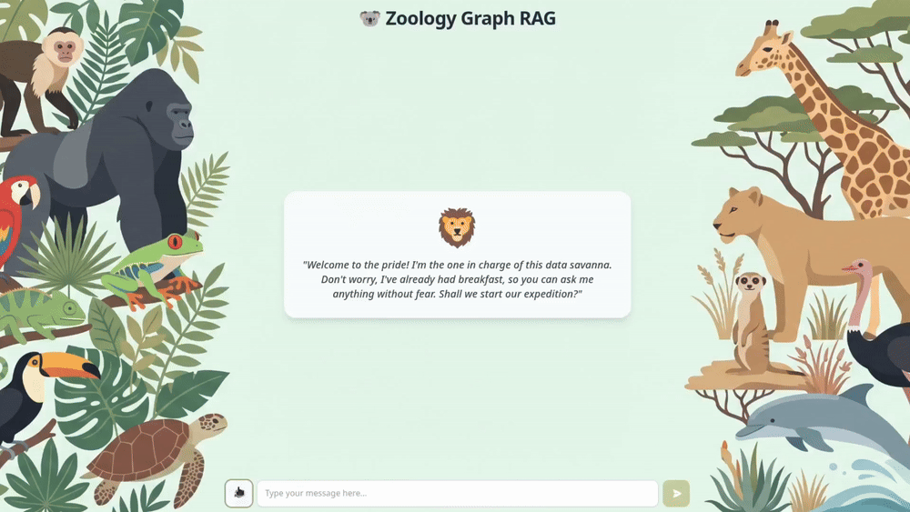

# Zoology GraphRAG 🦁🔍

Sistema **Graph RAG** (Retrieval-Augmented Generation basado en grafos de conocimiento) aplicado al dominio de la **zoología y el mundo animal**.

El sistema construye automáticamente un grafo de conocimiento en **Neo4j** a partir de fuentes de datos abiertas (Wikipedia, A-Z Animals, Animalia), y permite responder preguntas en lenguaje natural combinando recuperación estructurada (Cypher), recuperación semántica (vectorial + full-text) y un sistema agéntico multi-paso capaz de razonar sobre consultas complejas.

> 📄 La memoria completa del proyecto está disponible en [`project_report.pdf`](./project_report.pdf).

## Demo

Prueba la aplicación: [**Zoology GraphRAG**](https://zoology-graph-rag.vercel.app/)



## Autores

- Sandra Conde González
- Pablo Folgueira Galán

## Índice

- [Características principales](#características-principales)
- [Arquitectura del sistema](#arquitectura-del-sistema)
- [Estructura del proyecto](#estructura-del-proyecto)
- [Requisitos previos](#requisitos-previos)
- [Instalación](#instalación)
- [Uso](#uso)
- [Modelo de datos](#modelo-de-datos)
- [Evaluación](#evaluación)
- [Tecnologías utilizadas](#tecnologías-utilizadas)

## Características principales

- **Construcción automática del grafo**: ingesta y scraping de fuentes (Wikipedia, A-Z Animals, Animalia), chunking jerárquico en dos fases y extracción de entidades/relaciones mediante LLMs con un pipeline multi-paso de reducción de alucinaciones (chain-of-thought de auditoría).
- **Resolución de entidades**: mediante enums predefinidos, descripciones guiadas por esquema y resolución dinámica de especies vía LLM (sinónimos, plurales, generalización de subespecies).
- **Preprocesamiento para RAG**: generación de preguntas hipotéticas (*hypothetical questions*) por chunk para mejorar la recuperación semántica.
- **Múltiples estrategias de recuperación**:
  - **Text2Cypher**: traducción de lenguaje natural a consultas Cypher con ejemplos *few-shot* y mapas terminológicos.
  - **RAG híbrido**: combinación de búsqueda vectorial (sobre preguntas hipotéticas) y búsqueda full-text, con normalización, ponderación y *reranking* (`bge-reranker-v2-m3`).
  - **Consultas manuales predefinidas**: queries Cypher optimizadas para patrones recurrentes del dominio.
- **Sistema agéntico**: un Agente Enrutador decide la estrategia óptima (incluyendo un Agente Razonador Multipaso para preguntas *multi-hop*), un Agente Generador redacta la respuesta final con citas al contexto, y un Agente Crítico evalúa fidelidad y completitud, activando un ciclo de refinamiento iterativo cuando es necesario.
- **Evaluación cuantitativa**: benchmark propio de 50 preguntas y métricas de *Tool Selection Accuracy*, *Context Recall*, *Faithfulness* y *Answer Correctness*.

## Arquitectura del sistema

```
Consulta usuario
      │
      ▼
 Router Agent ──► greeting / skills / out_of_scope ──► Respuesta directa
      │
      ├──► hybrid_search / text2cypher / predefined_queries ──► Retriever correspondiente
      │
      └──► complex_query ──► Multihop Reasoner Agent (text2cypher + semantic retriever)
                                          │
                                          ▼
                                   Answer Agent (síntesis + citas)
                                          │
                                          ▼
                                   Critic Agent (fidelidad / completitud)
                                          │
                              ┌───────────┴───────────┐
                          completo y fiel         incompleto/infiel
                              │                         │
                              ▼                         ▼
                          Respuesta final      Nuevas subconsultas → vuelta al Router
```

## Estructura del proyecto

```
GraphRAG-IAC/
├── app.py                     # Punto de entrada de la aplicación
├── pyproject.toml             # Dependencias y configuración del proyecto Python
├── project_report.pdf         # Memoria completa del proyecto
├── data/                      # Datos de benchmark para evaluación
├── frontend/                  # Interfaz web (React + Vite + Tailwind)
│   └── src/
│       ├── App.jsx
│       └── ChatInterface.jsx
├── graphrag/                  # Núcleo del sistema
│   ├── config.py
│   ├── agents/                # Router, Multi-hop Planner, Critic, Retriever tools
│   ├── evaluation/            # Métricas y evaluador del sistema
│   ├── graph/                 # Gestor de conexión y operaciones sobre Neo4j
│   ├── ingestion/              # Extracción de entidades, chunking, limpieza del grafo
│   ├── llm/                   # Clientes para Gemini, Groq y Ollama
│   ├── retrieval/              # Retrievers: vectorial, full-text, híbrido, text2cypher, manual
│   ├── tests/                  # Tests unitarios
│   └── utils/                  # Chunking y generación de embeddings
├── notebooks/                  # Notebooks de demostración y evaluación
└── scraping/                   # Notebooks y datos de web scraping (fichas de animales en Markdown)
```

## Requisitos previos

- Python 3.11+
- Node.js 18+ (para el frontend)
- Una instancia de [Neo4j](https://neo4j.com/) (local o Aura)
- Claves de API de los proveedores LLM que se vayan a utilizar (Google Gemini, Groq y/o Ollama en local)

## Instalación

1. Clonar el repositorio:

   ```bash
   git clone https://github.com/pfolgueira/Zoology-GraphRAG.git
   cd Zoology-GraphRAG
   ```

2. Instalar las dependencias del backend:

   ```bash
   uv sync
   ```

3. Configurar las variables de entorno necesarias (credenciales de Neo4j y claves de API de los LLMs) en un archivo `.env` en la raíz del proyecto.

4. Instalar las dependencias del frontend:

   ```bash
   cd frontend
   npm install
   ```

## Uso

1. Ejecutar el proceso de ingesta para construir el grafo de conocimiento a partir de los datos disponibles en `scraping/data/` (ver los notebooks de `notebooks/` como referencia: `01_ingestion_demo.ipynb`).
2. Levantar el backend:

   ```bash
   uv run uvicorn app:app --host 0.0.0.0 --port 8000
   ```

3. Levantar el frontend:

   ```bash
   cd frontend
   npm run dev
   ```

4. Consultar el sistema desde la interfaz de chat, o explorar los notebooks `02_retrieval_demo.ipynb` y `03_evaluation_demo.ipynb` para probar los distintos retrievers y la evaluación del sistema.

## Modelo de datos

El grafo se centra en la etiqueta **`Species`** (con propiedades biométricas como peso, longitud, velocidad o esperanza de vida) y se conecta mediante relaciones a entidades como `Family`, `AnimalClass`, `SkeletalStructure`, `ReproductionMethod`, `EnvironmentType`, `Habitat`, `Location`, `ActivityCycle`, `SocialStructure`, `DietType`, `FoodSource` y `ConservationStatus`, entre otras. El detalle completo de etiquetas, propiedades, relaciones y su justificación se encuentra en la memoria del proyecto.

## Evaluación

El sistema se ha validado con un benchmark propio de 50 preguntas que cubre escenarios de saludo/fuera de dominio, recuperación directa, agregación, filtrado estructurado, datos faltantes, consultas semánticas y razonamiento multi-hop, midiendo:

- **Tool Selection Accuracy** — precisión del Agente Enrutador al elegir la estrategia de recuperación.
- **Context Recall** — cobertura de la información recuperada.
- **Faithfulness** — ausencia de alucinaciones respecto al contexto recuperado.
- **Answer Correctness** — precisión semántica y factual frente a una respuesta de referencia.

## Tecnologías utilizadas

- **Neo4j** — base de datos de grafos
- **Google Gemini 2.5 Flash-Lite** — extracción de entidades, generación y agentes (con soporte para Groq y Ollama)
- **bge-reranker-v2-m3** — reranking de resultados de recuperación
- **React + Vite + Tailwind CSS** — frontend de la aplicación
- **Python** — backend y lógica del sistema RAG